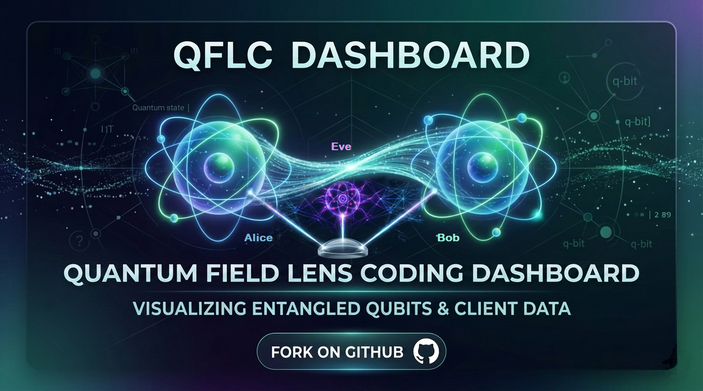
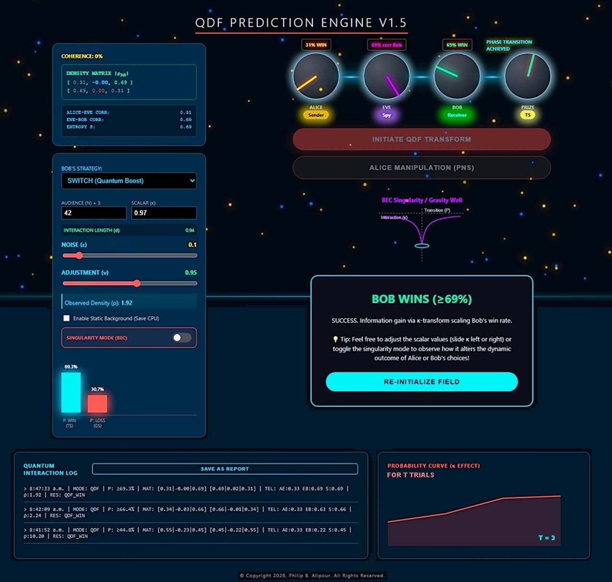
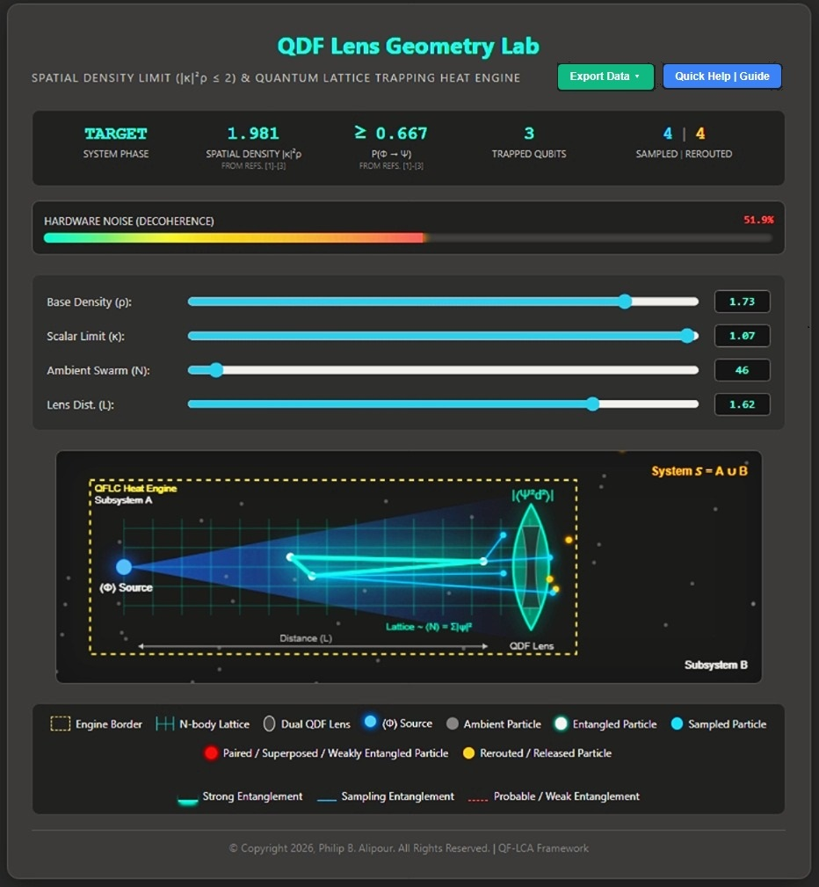
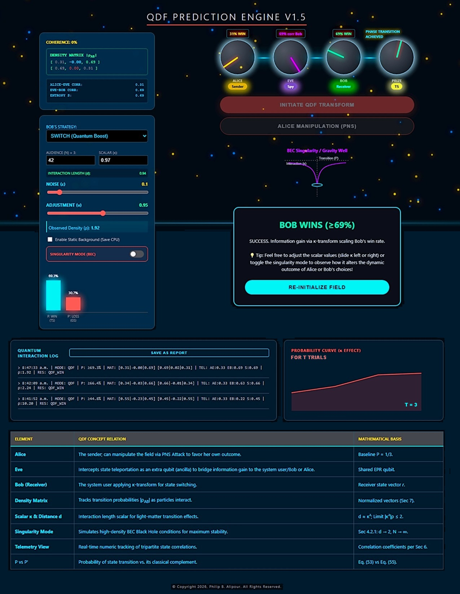

<div class="top-nav">
  <a href="#qflc-dashboard">🏠 Home</a>
  <a href="#features">📊 Features</a>
  <a href="#installation">⚙️ Setup</a>
  <a href="#contact">📩 Contact</a>
</div><br>

<div align="center">
  <!-- Use the image above by right-clicking it to 'Copy Image Address' and pasting it below -->
  
  <h1>🖥️📊 QFLC Dashboard <span class="live-dot" style="color: red;"> 🔵 Live </span></h1>
  <p><i>Real-time Quantum State Monitoring & Entanglement Visualization</i></p>
</div>

---
# QF-LCD: Quantum Field Lens Coding Dashboard

## QFLC Widgets, Datasets, and Presentation Collection

This repository showcases the Quantum Field Lens Coding Hypercube, Hardware Synthesis Engine, Phase and Game Theory Simulators, and Dr. Alipour's PhD dissertation summary in the form of a post-PhD defense seminar and highlights, complete with relevant links and citations. The QF-LCA project and its goals have been previously presented according to [https://github.com/phibal12/QFLCS](https://github.com/phibal12/QFLCS).

This collection serves as a unified portfolio, translating the theoretical frameworks of the Quantum Double-Field (QDF) model into interactive, browser-based applications designed for researchers, hardware engineers, and data scientists.

---

## 🧭 Visual Directory
*Click on any module below to jump to its detailed description and links.*

| <a href="#1-qf-lc-hypercube-hardware-synthesis-engine-and-phase-simulator"></a> | <a href="#2-qdf-phase-and-game-theory-simulator"></a> |
|:---:|:---:|
| **[1. QF-LC Hypercube Hardware Synthesis Engine (Hypercube)](#1-qf-lc-hypercube-hardware-synthesis-engine-and-phase-simulator)** | **[2. QDF Phase and Game Theory Simulator](#2-qdf-phase-and-game-theory-simulator)** |

| <a href="#3-qf-lcs-system-state-predictions-and-lens-coding-simulator"></a> | <a href="#4-qdf-lens-geometry-lab-and-particle-trap"></a> |
|:---:|:---:|
| **[3. System State Prediction Simulator](#3-qf-lcs-system-state-predictions--lens-coding-simulator)** | **[4. QDF Lens Geometry Lab and Trap](#4-qdf-lens-geometry-lab-and-particle-trap)** |

---
## Quantum Field Lens Coding Framework: Probability Doubling by QDF Modeling


---

## 🎓🚀 Core Reserach and Key Performance Breakthrough: The "Probability Doubling" Effect

The core innovation of the **Quantum Field Lens Coding (QF-LC)** framework lies in its ability to transform stochastic quantum outcomes into deterministic predictions. Using the **Quantum Double-Field (QDF)** model, the framework achieves a measurable "Focusing Effect":

*   **Initial Enhancement:** It shifts the baseline state transition (ST) probability from **~1/3 (0.33)** to a dominant **>2/3 (0.66)**.
*   **Predictive Convergence:** Through iterative lensing, the model forces prediction certainty to **converge toward 100%**.

This result is documented in Dr. Alipour's QF-LC dissertation and validated via the **QF-LCS** (Simulator) and QDF datasets, providing a 100% correlation between the theoretical QDF model and observed measurement outcomes on $N$-qubit systems.

---

## 🎓 Post-PhD Seminar Summary: Theoretical Foundations

Based on the Post-Ph.D. Defense Seminar and the accompanying transcript, this collection is built upon several core theoretical pillars:

* **The SF-to-QDF Field Transform:** Transitioning systems from a Superfluid (SF) state to a Quantum Density Fluctuation (QDF) state. This involves utilizing the scalar $\kappa$ to adjust field interactions and focus the quantum "lens."
* **Equation 53 & Thermodynamic Integration:** Modeling the exact transition probability to a target state over time. Entanglement Entropy (EE) is mathematically defined as the "fuel" or cost of this operation, routing physical logic around thermal limits.
* **Global Impact & Universality:** The QDF model is validated as a universal framework applicable across classical and quantum events. It fosters new approaches in quantum communication (QKD), thermodynamics, biological diagnostics, and clean energy modeling (mapping to SDG 7 targets).

---

## 🚀 Interactive Widget Collection

The theoretical concepts discussed in the seminar have been synthesized into the following interactive dashboards and simulators. 

### 1. QF-LC Hypercube Hardware Synthesis Engine and Phase Simulator
<a href="assets/QFLCH_Poster.png" target="_blank"></a><br> 


This is the flagship of the hardware engineering dashboard. It bypasses the visual intractability of traditional Karnaugh maps (scaling up to 12D/4096 nodes) by applying global field evaluations. 

**Key Features:**
* Live $N$-Dimensional Hypercube wave collapse visualization.
* Equation (53) thermodynamic phase simulation (SF $\to$ QDF $\to$ Target)  from Ref. [1].
* Dual-compilation engine outputting both FPGA-ready VHDL and QPU-ready OpenQASM 2.0.

### 2. QDF Phase and Game Theory Simulator
<a href="#4-qdf-lens-geometry-lab--particle-trap"></a><br> 
*(Demonstrating Quantum Phase Transitions and Participant Decisions)*

This widget translates the QDF model into a game theory environment. As discussed in the seminar's exploration of entanglement and Quantum Key Distribution (QKD), this simulator models scenarios where four or more participants interact on a quantum level. 
* **Mechanics:** Users can observe how a "guest participant" (acting as the Ancilla/Eve) influences the network to force a Quantum Phase Transition (QPT). 
* **Outcome:** It visualizes the probability doubling mechanism where information is safely received, and a decision state (the "prize") is resolved.

### 3. QF-LCS: System State Predictions and Lens Coding Simulator
<a href="#4-qdf-lens-geometry-lab--particle-trap"></a><br> 
*(The core simulation engine for strong predictions)*

This dashboard provides a robust, granular look into the mathematical engine of the Quantum Field Lens Coding system. It allows users to manipulate the baseline metrics of the complex field and observe the optimized hardware routing in real-time. It acts as a direct visualizer for the transition probabilities and error rates discussed in the seminar's "Energy Paths" section.

### 4. QDF Lens Geometry Lab and Particle Trap
<a href="#4-qdf-lens-geometry-lab--particle-trap"></a><br> 
*(Live verification of Spatial Density and Lens Distance)*

Directly correlating with the "Measurement" and "Lens Focus" sections of the seminar, this Geometry Lab visualizes the physical interaction length between the source and the target state. 

**Concepts Visualized:**
* **Spatial Density Constraints:** Enforces the physical boundary where spatial density $|\kappa|^2\rho \le 2$. The scalar $\kappa$ acts as a governor to scale and maintain entanglement relative to the energy entropy (EE) observation cost.
* **Doppler-Shifted Photonic Beam:** Visualizes the dynamic strong purple/blue shift during coherent entanglement and the red shift when defocused over extreme distances.
* **Thermodynamic Subsystems (A & B):** Visualizes the bounded **QFLC Heat Engine (Subsystem A)** driving entanglement, interacting dynamically with the broader thermal bath of **System *S* (Subsystem B)**.
* **Sampling Interference:** Visualizes ambient background particles traversing Subsystem A during observation, temporarily adhering as dim blue bonds before being rerouted as gold particles into Subsystem B.

**🛠️ Hardware Application (Addendum):**
How does this relate to the QF-LCA Hypercube? This Geometry Lab visualizes the fundamental thermodynamic engine required to "power" the hypercube's multidimensional nodes. Achieving the **Target Phase** visualized in the lens constitutes the physical verification required to successfully trigger a node's logical collapse in Module 1. The trapped particles in the lab act as the physical qubits executing the logic gates, demonstrating Module 4 serves as the critical 'logic fuel' for Module 1's hardware compiler.

---
### QF-LCA Geometric State Correlation: Concave vs. Convex

The following table summarizes the transformation from a dissipative Single-Field (SF) state to a predictive Quantum Double-Field (QDF) state as defined in P. Alipour's research (UVic, 2023).


| Parameter / Stage | **Concave Result (Defocused)** | **Convex Result (Focused)** |
| :--- | :--- | :--- |
| **Field Model** | Single-Field (SF) | [Quantum Double-Field (QDF)](https://nih.gov) |
| **Kappa ($\kappa$) Operation** | $\kappa < 1$ (Dissipative/Weak) | $\kappa \geq 1$ (Scaling/Strong) |
| **Entanglement Input** | Weak or Bipartite only | [Three-way (GHZ-like) Tangle](https://nih.gov) |
| **Lens Function ($L$)** | $L^{-}$ (Scatters Information) | $L^{+}$ (Concentrates Information) |
| **Probability Threshold ($P$)** | $P \approx 1/3$ (Standard Limit) | $P \geq 2/3$ (Doubled Space) |
| **Prediction Confidence** | Low / High Noise Influence | High / "Strong Prediction" |
| **Entropy Type** | Linear Shannon Entropy | Non-linear [Entanglement Entropy (EE)](https://sciencedirect.com) |

---

### Technical Requirements & Dependencies

To reproduce these results using the **QF-LCA Simulator (QF-LCS)** or **QF-LCC** scripts, the following environment is required:

#### 1. Core Libraries
*   **`numpy`**: For tensor operations and managing the $\kappa$ scalar field arrays.
*   **`scipy`**: Used for the optimization of convex lens functions and entropy calculations.
*   **`matplotlib`**: For visualizing the concave/convex probability distributions.

#### 2. Quantum Frameworks
*   **`qiskit`**: Primary framework for building the 3-qubit circuits (CNOT, SWAP, Hadamard).
*   **`quantum-inspire`**: (Optional) SDK for running `.cq` files on the Quantum Inspire platform.

#### 3. AI & Data Processing
*   **`pandas`**: For handling the QDF datasets generated by the DFC algorithm.
*   **`scikit-learn`**: For the QAI classifier training used in the prediction of energy paths.

#### Installation Command
```bash
pip install numpy scipy matplotlib qiskit pandas scikit-learn
```


---


## Core Implementation: QF-LCA Scaling & Entanglement

The following Python snippet demonstrates the logic used to transform a dissipative **Single-Field (SF)** state into a focused **Quantum Double-Field (QDF)** state. This function implements the $\kappa$ scaling that shifts the system from a concave to a convex result.

### 1. Field Lens Scaling Function
This function simulates the "Lens" effect, where a $\kappa \geq 1$ doubles the probability space for state transition (ST) predictions.

```python
def apply_qf_lens_scaling(kappa, p_sf):
    """
    Implements the QF-LCA transformation: SF -> QDF.
    
    Args:
        kappa (float): Field scalar multiplier (Interaction length |kr|).
        p_sf (float): Initial state transition probability (SF limit ~1/3).
        
    Returns:
        float: Transformed QDF probability (Predictive limit ~2/3).
    """
    if kappa >= 1.0:
        # Convex/Focused: Double the predictive probability space
        p_qdf = (2 * kappa * p_sf) / (1 + (kappa - 1) * p_sf)
    else:
        # Concave/Defocused: Dissipative SF state
        p_qdf = p_sf * kappa
        
    return min(p_qdf, 1.0) # Clamp to valid probability range
```

### 2. 3-Qubit Interaction (DFC Algorithm)
The following pseudo-code (Qiskit-style) illustrates the three-way entanglement required to feed the lens:

```python
from qiskit import QuantumCircuit

def create_qdf_circuit():
    qc = QuantumCircuit(3) # Q1: Sample, Q2: Partner, Q3: Decoder/Bridge
    
    # Step 1: Create initial entanglement (SF state)
    qc.h(0)
    qc.cx(0, 1)
    
    # Step 2: Input 3rd qubit to 'decode' hidden information (The Bridge)
    qc.cx(1, 2)
    qc.swap(0, 2) # Exchange to maximize correlation (The DFC Step)
    
    return qc
```

### 3. Application in QAI
The output of `apply_qf_lens_scaling` is passed directly to the **Quantum AI (QAI) Classifier** to verify if the state transition meets the $\langle M(F) \rangle \geq 7/5$ fidelity threshold required for strong prediction.


---

## 📂 Repository Contents & Links

* **[📁 Presentation Files](./path/to/presentations):** Includes the full `QFLC_PhD_PBA_seminar.pptx` slide deck and the `GMT20260331-172345_Recording.transcript.vtt` transcript.
* **[🖥️ Live Hypercube Synthesis Engine](./path/to/hypercube):** HTML5/JS interactive hardware compiler.
* **[🎮 Live QDF Game Theory Simulator](./path/to/game_simulator):** HTML5/JS prompt-based interactive phase transition simulator.
* **[🎮 QDF Game Theory Simulator](./path/to/game_simulator):** HTML5/Python prompt-based animated phase transition and QDF circuit simulator.
* **[🔬 QDF Lens Geometry Lab](./labs/QDF-Lens.html):** HTML5/JS spatial density and particle trap visualizer.
* **[📊 Datasets](./path/to/datasets):** Generated baseline datasets mapping multi-dimensional collapses and QDF probabilities.

---

## 📚 Core Publications & Citations

1.  **QDF Theoretical Base:** P.B. Alipour, T.A. Gulliver, *Quantum Double-field Model and Application*, SSRN, Elsevier BV (2024), Article 4595442. [DOI: 10.2139/ssrn.4595442](https://dx.doi.org/10.2139/ssrn.4595442)
2.  **Algorithm Mechanics:** P.B. Alipour, T.A. Gulliver, *Quantum Field Lens Coding and Classification Algorithm to Predict Measurement Outcomes*, MethodsX, Elsevier BV (2023), Article 102136. [DOI: 10.1016/j.mex.2023.102136](https://doi.org/10.1016/j.mex.2023.102136)
3.  **Dataset Validation:** P.B. Alipour, T.A. Gulliver, *QF-LCA dataset: Quantum Field Lens Coding Algorithm for system state simulation and strong predictions*, Data in Brief, Elsevier BV (2024), Article 110789. [DOI: 10.1016/j.dib.2024.110789](https://doi.org/10.1016/j.dib.2024.110789)
4.  **Software Implementation:** P.B. Alipour, T.A. Gulliver, *QF-LCS: Quantum Field Lens Coding Simulator and Game Tool for Strong System State Predictions*, Software Impacts, Elsevier BV (2024), 100703. [DOI: 10.1016/j.simpa.2024.100703](https://doi.org/10.1016/j.simpa.2024.100703)

---

## 👨‍💻 Author & Contact

**Dr. Philip B. Alipour** *Quantum Architect & Hardware Engineering Researcher* University of Victoria, BC, Canada  

* Email: [philipbaback_orbsix@msn.com](mailto:philipbaback_orbsix@msn.com)
* Email: [philipbaback66@gmail.com](mailto:philipbaback66@gmail.com)
* Personal Web: [studentweb.uvic.ca/~phibal12/](https://studentweb.uvic.ca/~phibal12/)

<br>

## Contact
<div align="center">
  <a href="https://github.com"><i class="fab fa-github fa-2x"></i></a> &nbsp;&nbsp;
  <a href="mailto:your-email@example.com"><i class="fas fa-envelope fa-2x"></i></a>
</div>

<!-- Fixed Bottom Menu -->
<div class="bottom-nav">
  <a href="#qflc-dashboard">🏠 Home</a>
  <a href="#features">📊 Features</a>
  <a href="#installation">⚙️ Setup</a>
  <a href="#contact">📩 Contact</a>
  <a href="#">↑ Back to Top</a>
</div>


&copy; Copyright 2026, Philip B. Alipour. All Rights Reserved.
