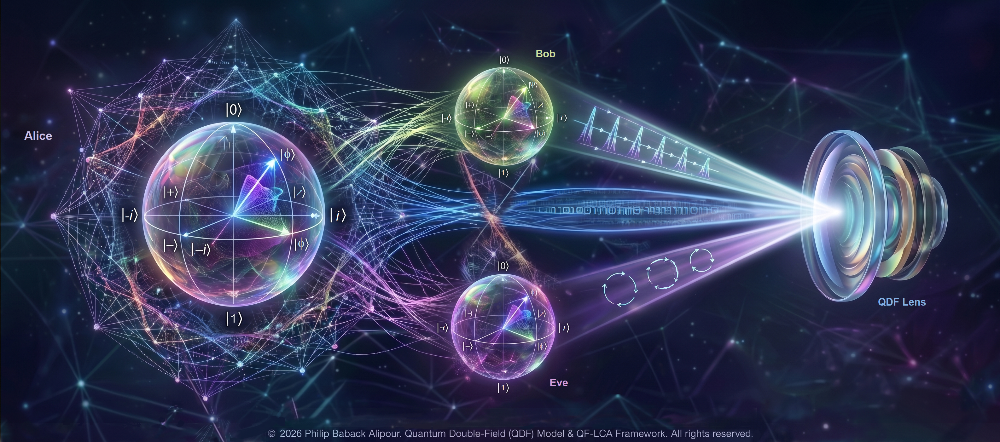
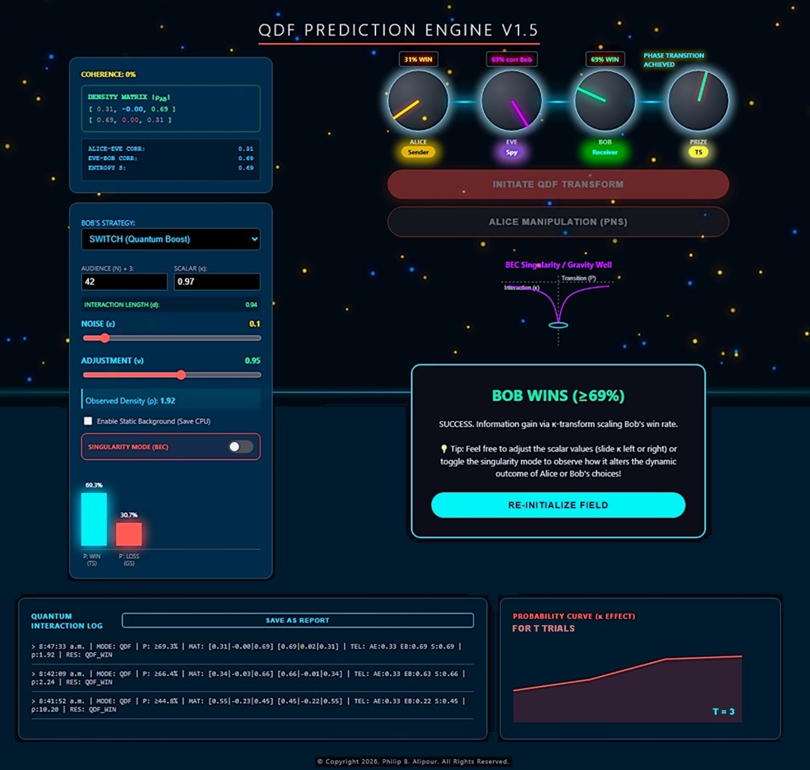
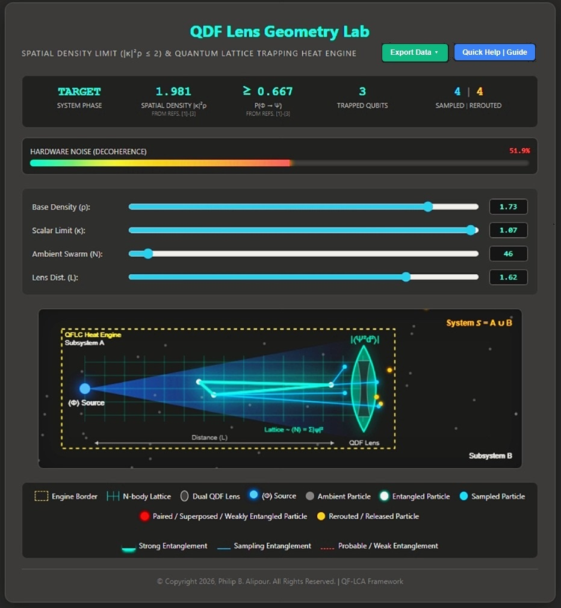
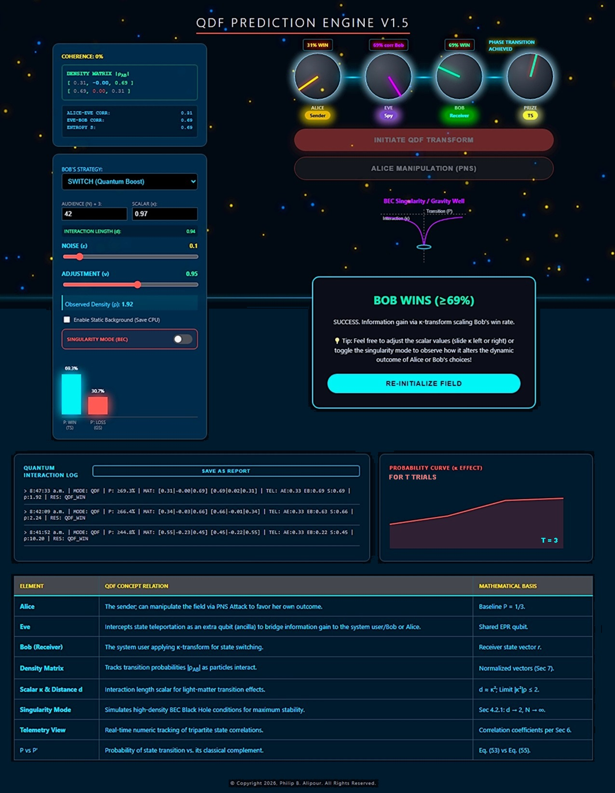

<!-- Top Menu -->
<!-- Fixed Bottom Menu -->

  <a href="https://github.com/phibal12/QFLC-Dashboard/edit/main/README.md">🏠 GitHub Home</a>
  <a href="#core-objectives">📊 Features</a>
  <a href="#env-setup">🛠 Setup</a>
  <a href="#-repository-contents--widget-links">⊞ Widgets</a>
  <a href="#contact">📩 Contact</a>
  <a href="#-profile">👨‍💻 Profile</a>

  <h1>🖥️📊 QFLC Dashboard  🔵 Live </h1>
  
<i>Real-time Quantum State Monitoring, Entanglement Visualization of Qubits and Client Data</i>

---

  <h1 style="font-size: 42px;"> QF-LCD: Quantum Field Lens Coding Dashboard </h1>
  <!-- Use the image below by right-clicking it to 'Copy Image Address' and pasting it below -->
   

 
<i>Banner description: The $QDF$ Dual-Lens architecture ($L^+$ focus / $L^-$ defocus) applied to $ABE$ (Alice--Bob--Eve) tripartite state discrimination. Eve's ancilla qubit can decode and reveal the hidden Bell state information from this three-way entanglemet (quantum information) network.</i>

  
  <h1>🖥️📊 QFLC Dashboard  🔵 Live </h1>
  
<i>Real-time Quantum State Monitoring, Entanglement Visualization of Qubits and Client Data</i>

<meta property="og:title" content="QFLC-Dashboard: Quantum Field Lens Coding">
<meta property="og:description" content="A specialized simulator and validator for Quantum Double-Field (QDF) models and logic stability.">
<meta property="og:image" content="https://github-readme-stats.shion.dev/api/pin/?username=phibal12&repo=QFLC-Dashboard&theme=tokyonight">

       
  
   
 
 
  <a href="https://github.com/phibal12/QFLC-Dashboard">
    
  
    
  </a>

Math Mode:  

📂 ⚙️ Automated Web Script: MathJax Equations Engine & Config.

⚛️⚙️ ⚡<a href="README_Technical.html">Project Setup & System Requirements</a>
The QFLC Dashboard executes primarily client-side via WebGL/HTML5. However, specific modules (like the **QFLCH Synthesis Engine**) may require external connectivity for hybrid quantum-classical operations. Please refer to the relevant notes on project setup and system requirements. 

<!-- ========================================================= -->
<!-- 2. WIDGET BUTTON ATTACHMENTS FOR YOUR TEXTS                -->
<!-- ========================================================= -->

<!-- Section 1: About the Author 

    

        <button class="qflc-btn qflc-play-btn" data-audio="audio/about-me.mp3">
            🔊 Listen Section
        </button>
        <button class="qflc-btn qflc-speed-btn">1.0x (Author-based AI Gnenerated Voice)</button>
    

    

        

    

 -->

<!-- Section 2: Project Description 

    

        <button class="qflc-btn qflc-play-btn" data-audio="audio/project-desc.mp3">
            🔊 Listen Section
        </button>
        <button class="qflc-btn qflc-speed-btn">1.0x (Author-based AI Gnenerated Voice)</button>
    

    

        

    

 -->

<!-- ========================================================= -->
<!-- 3. LIGHTWEIGHT AUDIO ENGINE LOOPS WITH SPEED MANAGEMENT    -->
<!-- ========================================================= -->

---
### Predictive State Simulation for <i>N</i>-Qubit Machines

Welcome to the interactive portal for **Quantum Field Lens Coding (QF-LC)**. This dashboard demonstrates the implementation of the **Quantum Double-Field (QDF)** model, a novel framework for predicting state transitions (ST) and phase transitions (PT) in quantum and classical systems.
The dashboard provides a robust, granular look into the mathematical engine of the QF-LC system. 
It allows users to manipulate the baseline metrics of the complex/scalar field and observe the optimized hardware routing in real-time. 
It acts as a direct visualizer for the ST probabilities and error rates discussed in the Ph.D. dissertation defence seminar's "Energy Paths" section.

**Quantum Field Lens Coding Algorithm (QF-LCA):** is an advanced quantum simulation and classification algorithm that utilizes QDF circuits to encode-decode, (de)focus, and analyze particle energy states. By using entanglement and QF lenses to map Ground States (GS) and Excited States (ES), the algorithm projects and predicts system events with high probability, often doubling prediction accuracy.

**Key Aspects of QF-LC Mechanism:** QF-LCA uses qubit pair entanglement (specifically CNOT operators) to create QDFs that represent energy states, often applied to thermodynamic system simulations.

**Functionality:** QF-LCA acts as a "lens" by focusing energy state distributions to distinguish between GS/ES, allowing for the classification of particles and re-routing of energy paths to meet a target state (TS). 

**Prediction:** The algorithm improves prediction accuracy from $\(P \ge 1/3\)$ to $\(P \ge 2/3\)$ (or similar enhancements) by transforming single-field (SF) data into a QDF.

**Applications:** Physics/Thermodynamics: Simulating particle behavior, managing energy transitions in systems, and analyzing entanglement entropy. AI/Machine Learning: The QF-LC algorithm (QF-LCA) can be combined with quantum AI (QAI) to classify states. Hardware Synthesis: FPGA-QASM and hybrid design solutions via QF-LCA QDF circuit design and application via three-way entanglement design solution, distribution and optimization. 

**Data Analysis:** The QF-LCS (Quantum Field Lens Coding Simulator) uses CLI/GUI tools to analyze measurement data from quantum computers to predict system events and propose efficient energy pathways, system design and performance as a target state (a desired Hamiltonian).

**Context:** The method, often termed QF-LCA, has been validated using quantum hardware, for example, through methods detailed in this ScienceDirect article.This approach is highly relevant for quantum computing, providing a way to handle high-dimensional datasets and improve the reliability of quantum simulations.

## ⚙️🚀 Core Capabilities
This simulation environment showcases the **QF-LC Algorithm (QF-LCA)**, which provides a significant advantage in predictive fidelity compared to traditional benchmarks like the Quantum Fourier Transform (QFT).

- **Dynamic State Prediction:** Real-time calculation of transition probabilities across $N$-qubit architectures.
- **Phase Transition (PT) Identification:** Automated detection of critical points using the $P \geq 2/3$ threshold.
- **Entanglement Entropy (EE) Analysis:** Visualization of thermodynamic metrics and system entropy during state evolution.
- **Hardware Agnostic:** Designed for integration with NISQ-era devices and simulated quantum environments (Python/Qiskit based).

## 📊 Interactive Modules: QFLC Widgets, Datasets, and Presentations

**Widget Logic:** 

 
       

This repository showcases the Quantum Field Lens Coding Hypercube, Hardware Synthesis Engine, Phase and Game Theory Simulators, and Dr. Alipour's PhD dissertation summary in the form of a post-PhD defence seminar and highlights, complete with relevant links and citations. The QF-LCA project and its goals have been previously presented according to [https://github.com/phibal12/QFLCS](https://github.com/phibal12/QFLCS).

This collection serves as a unified portfolio, translating the theoretical frameworks of the Quantum Double-Field (QDF) model into interactive, browser-based applications designed for researchers, hardware engineers, and data scientists.

*Explore the widgets below to interact with the QF-LCS (Simulator) engine:*

1. **The QDF Engine:** Adjust system parameters to see how the Double-Field approach enhances prediction values during the decoding step.
2. **Phase Transition Tracker:** Monitor how your $N$ qubits reach critical thresholds.
3. **Comparative Benchmarking:** Toggle between QF-LCA and standard QFT outputs to visualize the "Lens Coding" advantage.

---

## 👁🧭 Visual Directory
*- Click on any module image below to jump to its interactive environment.*  
**OR**  
*- Click on any module text link below to jump to its detailed description and links.*

|  |  |
|:---:|:---:|
| **[1. QF-LC Hypercube Hardware Synthesis Engine (Hypercube)](#1-qf-lc-hypercube-hardware-synthesis-engine-and-phase-simulator)** | **[2. QDF Phase and Game Theory Simulator](#2-qdf-phase-and-game-theory-simulator)** |

|  |  |
|:---:|:---:|
| **[3. System State Prediction Simulator](#3-qf-lcs-system-state-predictions--lens-coding-simulator)** | **[4. QDF Lens Geometry Lab and Particle Trap](#4-qdf-lens-geometry-lab-and-particle-trap)** |

---
## QFLC Framework: Probability Doubling by QDF modelling

  

---

## 🎓🚀 The <i>Probability Doubling</i> Effect as the Core Research and Performance Breakthrough

  

The core innovation of the **Quantum Field Lens Coding (QF-LC)** framework lies in its ability to transform stochastic quantum outcomes into deterministic predictions. Using the **Quantum Double-Field (QDF)** model, the framework achieves a measurable "Focusing Effect":

*   **Initial Enhancement:** It shifts the baseline state transition (ST) probability from $\geq 1/3 (>0.33)$ to a dominant $\geq 2/3 (>0.66)$.
*   **Predictive Convergence:** Through iterative lensing, the model forces prediction certainty to **converge toward 100%**.

This result is documented in Dr. Alipour's QF-LC dissertation and validated via the **QF-LCS** (Simulator) and QDF datasets, providing a 100% correlation between the theoretical QDF model and observed measurement outcomes on $N$-qubit systems.

---

## 🎓 Post-PhD Seminar Summary

Based on the Post-Ph.D. Defence Seminar and the accompanying transcript, this collection is built upon several core theoretical pillars:

* **The SF-to-QDF Field Transform:** Transitioning systems from a Superfluid (SF) state to a Quantum Density Fluctuation (QDF) state. This involves utilizing the scalar $\kappa$ to adjust field interactions and focus the quantum "lens."
* **Equation (53) and Thermodynamic Integration:** modelling the exact transition probability to a target state over time. Entanglement Entropy (EE) is mathematically defined as the "fuel" or cost of this operation, routing physical logic around thermal limits.
* **Global Impact and Universality:** The QDF model is validated as a universal framework applicable across classical and quantum events. It fosters new approaches in quantum communication (QKD), thermodynamics, biological diagnostics, and clean energy modelling (mapping to SDG 7 targets).

---
**Current Status:** Generalizing for academic R&D, industrial and societal applications. Two new publications regarding high-fidelity state-classification are currently in preparation, and another under peer-review by Societal Impacts journal.

[GitHub Repository](https://github.com) | [Contact Developer](mailto:phibal12@uvic.ca)

---

## 🖲️⊞ Interactive Widget Collection

The theoretical concepts discussed in the seminar have been synthesized into the following interactive dashboards and simulators. 

### 1.🧮🧊 QF-LC Hypercube Hardware Synthesis Engine and Phase Simulator
  

This is the flagship of the hardware engineering dashboard. It bypasses the visual intractability of traditional Karnaugh maps (scaling up to 12D/4096 nodes) by applying global field evaluations. Beyond standard 2D/3D visualizations, this project utilizes the **QFLC Hypercube** (QFLCH) framework to map the evolution of $N$-qubit systems. As quantum systems scale, traditional Bloch sphere representations become insufficient; the QFLCH provides a scalable, topological map of the **Quantum Double-Field (QDF)** space.

**Key Features:**
* Live $N$-Dimensional Hypercube wave collapse visualization.
* Equation (53) thermodynamic phase simulation (SF $\to$ QDF $\to$ Target)  from Ref. [1].
* Dual-compilation engine outputting both FPGA-ready VHDL and QPU-ready OpenQASM 2.0.
- **Topological Mapping:** Visualizes the relationship between vertex positions and Entanglement Entropy (EE), identifying "ty zones" within the state space.
- **Error Mitigation Geometry:** Uses hypercubic symmetry to predict and bypass regions of high decoherence, offering a geometric approach to quantum error correction.
- **State Pathing:** Trace the trajectory of a state transition (ST) as it moves through higher-dimensional vertices, providing a visual proof of the QF-LCA predictive advantage.

### 🧮🧊 Advanced Topological Insights
The QFLC Hypercube serves as more than a visualization; it is a **Ty-map** or $\mathcal{T}_y$-map.

🧊⚛️📍 <a href="https://hdl.handle.net/1828/23705">QFLCH Function as a Ty-Map via State Matrix $(x, y)$ Coordinates</a>
 
The QF-LC algorithm (QFLCA) uses variable coordinates $x$ and $y$ to construct the QDF state arrays on the hypercube. The metric $y$ calculates the distance between a reference node $x$ and any target node $y$ on the hypercube that can represent tripartite (ABE) entangled particles. Together, these variables create random number matrices that encode passcodes, building the exact visual configuration of the quantum circuit ($z[i]$, where $i=0,1,2..$ is the $i$-th circuit element) across the hypercube's vertex network. This metric allows the **QFLCH** algorithm to run quantum lens distance-based classification program (QFLCS) by extracting the keys from $z[i]$ of the QDF circuit. This is after the QFLCS program loops through the index $i$. 

By analyzing the vertex-to-vertex  transitions within the QDF model and QF lens distances between nodes, it achieves:
*   **Predictive Pathing:** We can identify the most efficient "energy paths" for state changes.
- **Quantum Thermodynamics:** Identifying low-entropy paths to maximize system efficiency. This distance tracks changes in Entanglement Entropy (EE) or thermodynamic state transitions.
- **Biomedicine:** Mapping out how damaged DNA strands mutate to predict the physical growth velocity of virus or cancer cell lines. he metric measures the data distance between normal cells ($x$) and mutated targets ($y$) to predict the physical growth velocity of a biological system.
- **Cybersecurity / Social Lensing:** Modelling data propagation networks to detect and halt the vector spread of malicious misinformation.
*   **Decoherence Buffers:** The hypercube geometry highlights topological regions where Entanglement Entropy is naturally minimized, aiding in error-resilient algorithm design.

*This framework is the subject of an upcoming publication focused on the geometric foundations of quantum-classical hybrid stability.*

<!-- Video or gif image/clip of the simulation sample goes right here -->

### 🧠👁🧩 Understanding the Live QF-LC Hypercube (QFLCH) Simulation
When executing the interactive simulation above using a high-fidelity state combination (e.g., the **4D Dimensions** with Minterm option addressing a given input of **0, 2, 8, 10** at **T ≈ 0.93 K**), the QFLCH canvas dynamically tracks real-time hardware actions:

- **Active Geometric Sub-Cubes (Bob & Alice):** The neon nodes and paths display the minimized classical hardware routing tracks. This represents Alice's field scaling mapping over Bob's ground-state spatial targets, locked strictly to an $\mathcal{O}(N^2)$ tracking footprint.
- **The Oscillating Photon Field Web (Eve's Injection):** The white, dynamically shifting triangular bridge lines manifest the **Three-Way Entanglement Network ($N \geq 3$)**. This visualizes Eve's real-time ancilla qubit injection port intercepting the active pairs.
- **Deterministic State Lock-In ($P \to 0.99$):** The real-time oscillation demonstrates the decoding of hidden Bell state information out of ambient background noise. This optimization effectively doubles the transition probability space, proving the system's ability to eliminate cryogenic processing bottlenecks in real time.

### 2.🎯🔄 QDF Phase and Game Theory Simulator
  
*(Demonstrating Quantum Phase Transitions and Participant Decisions)*

This widget translates the QDF model into a game theory environment. As discussed in the seminar's exploration of entanglement and Quantum Key Distribution (QKD), this simulator models scenarios where four or more participants interact on a quantum level. 
* **Mechanics:** Users can observe how a "guest participant" (acting as the Ancilla/Eve) influences the network to force a Quantum Phase Transition (QPT). 
* **Outcome:** It visualizes the probability doubling mechanism where information is safely received, and a decision state (the "prize") is resolved.

### 3.🧮⚛ QF-LCS: System State Predictions and Lens Coding Simulator
  
*(The core simulation engine for strong predictions)*

This widget simulates ...

### 4.🔬⚛️ QDF Lens Geometry Lab and Particle Trap
<!-- <a href="#4-qdf-lens-geometry-lab--particle-trap"> -->
  
*(Live verification of Spatial Density and Lens Distance)*

Directly correlating with the "Measurement" and "Lens Focus" sections of the seminar, this Geometry Lab visualizes the physical interaction length between the source and the target state. 

**💡👁🧩 Concepts Visualized:**
* **Concepts Visualized Spatial Density Constraints** Enforces the physical boundary where spatial density $¦\kappa^2¦ \rho \le 2$. The scalar kappa acts as a governor
 to scale and maintain entanglement relative to the energy entropy (EE) observation cost.
* **Doppler-Shifted Photonic Beam:** Visualizes the dynamic strong purple/blue shift during coherent entanglement and the red shift when defocused over extreme distances.
* **Thermodynamic Subsystems (A & B):** Visualizes the bounded **QFLC Heat Engine (Subsystem A)** driving entanglement, interacting dynamically with the broader thermal bath of **System *S* (Subsystem B)**.
* **Sampling Interference:** Visualizes ambient background particles traversing Subsystem A during observation, temporarily adhering as dim blue bonds before being rerouted as gold particles into Subsystem B.

* For the detailed implementation, reproducibility, and software application simulated to evaluate the QF-LCA Geometric State Correlation: Concave vs. Convex see this its relevant section here...

**🛠️ Hardware Application (Addendum):**
How does this relate to the QF-LCA Hypercube? This Geometry Lab visualizes the fundamental thermodynamic engine required to "power" the hypercube's multidimensional nodes. Achieving the **Target Phase** visualized in the lens constitutes the physical verification required to successfully trigger a node's logical collapse in Module 1. The trapped particles in the lab act as the physical qubits executing the logic gates, demonstrating Module 4 serves as the critical 'logic fuel' for Module 1's hardware compiler.

---

## 📂 Repository Contents & Widget Links

* **[📁 Presentation Files](./path/to/presentations):** Includes the full `QFLC_PhD_PBA_seminar.pptx` slide deck and the `GMT20260331-172345_Recording.transcript.vtt` transcript.

  
<b>⊞️ Widget Files & Links</b>

   
  <!-- Intro Text -->
  
⊞ <b>Click on any widget link to run its program directly:</b>

  
  <!-- Start of HTML List -->
  <ul>
    <li>
      <b><a href="https://phibal12.github.io/QFLC-Dashboard/labs/QFLCH">🖥️ Live QF-LC Hypercube Synthesis Engine</a>:</b> 
      HTML5/JS interactive hardware compiler.
    </li>
    <li>
      <b><a href="https://phibal12.github.io/QFLC-Dashboard/labs/QFLCH5_py">🔬 Live QF-LC Hypercube Entanglement Node Sample Generator</a>:</b> 
      HTML5/Python interactive hypercube entangled node generator and state transition lab.
    </li>
    <li>
      <b><a href="./labs/QDF-Lens.html">🔬 QDF Lens Geometry: Lab 01</a>:</b> 
      HTML5/JS spatial density and QDF particle trap visualizer.
    </li>
    <li>
      <b><a href="./labs/qflca_optimizer_py.html">🔬 QDF Lens Geometry: Lab 02</a>:</b> 
      HTML5/Python spatial density and QDF scalar optimizer.
    </li>
    <li>
      <b><a href="https://phibal12.github.io/QFLCS/">🖥️ QF-LCS: System State Predictions and Lens Coding Simulator</a>:</b> 
      HTML5/Python QDF circuit and phase transition simulator.
    </li>
    <li>
      <b><a href="https://phibal12.github.io/QFLC-Dashboard/labs/QuSole_QDF_v1-14">🖥️ QuSole: Quantum Social Lens Coding Simulator and Database</a>:</b> 
      HTML5/JS societal impact, target state and Intelligent Decision Simulator (IDS) simulator based on the QF-LC algorithm. <i>under review</i>
    </li>
    <li>
      <b><a href="https://phibal12.github.io/QFLC-Dashboard/labs/QAI_LCode_v1-4">🔬 QuSole & QF-LCA TRI-CORE CONSOLE v1.4</a>:</b> 
      HTML5/JS QuSole Dataset Visualizer, Validator and Intelligent Decision Simulator (IDS).
    </li>
    <li>
      <b><a href="https://phibal12.github.io/QFLC-Dashboard/labs/QDF_P_Engine">🖥️🎮 Live QDF Phase and Game Theory Simulator</a>:</b> 
      HTML5/JS interactive phase transition simulator and QDF prediction engine.
    </li>
    <li>
      <b><a href="./labs/QFLCH5_py">🔬 QDF Lens Geometry Lab 03</a>:</b> 
      HTML5/Python spatial density and QDF particle trap and entropy visualizer.
    </li>
    <li>
      <b><a href="https://phibal12.github.io/QFLCS/">🎮 QDF Game Theory Simulator</a>:</b> 
      HTML5/Python prompt-based animated phase transition and QDF circuit simulator.
    </li>
    <li>
      <b><a href="https://phibal12.github.io/QFLCS/">🎮 Hybrid Quantum-Classical Based Game Product</a>:</b> 
      HTML5/JS prompt-based animated characters and AI decision tree for Target State simulator.
    </li>
    <li>
      <b><a href="https://www.deviantart.com/phibal12">🎮 Phibal12 Games by Mojan Zygon RTL: Entertainment Dept.</a>:</b> 
      Preview of incomplete PC Games developed since early 2000s transforming into their today versions via AI and quantum AI. HTML5/JS/C++/VB.NET/Legacy DOS 2.xD/3D/4D dynamic characters in their worlds and AI decision tree for their Target State game outcomes/results.
    </li>
    <li>
      <b><a href="./path/to/datasets">📊 Datasets</a>:</b> 
      Generated baseline datasets mapping multi-dimensional collapses and QDF probabilities.
    </li>
  </ul>

---

## 👨‍💻 Profile
<!-- Portrait or gif image/clip of the simulation sample goes right here 

    Specializing in quantum computational modelling and interactive thermodynamic systems, bridging the gap between complex algorithmic logic and visual data discovery. 

   -->

  
  

  

    <strong>Dr. Philip B. Alipour </strong> specializes in Quantum Computational modelling and Interactive Thermodynamic Systems, bridging the gap between complex algorithmic logic, visual data lab discovery and real-world datasets.   
  
  <!-- Place at the very top of simulator/widget layout -->
<nav style="width: 100%; background: rgba(11, 17, 30, 0.95); border-bottom: 1px solid rgba(0, 229, 255, 0.3); padding: 10px 1px; box-sizing: border-box; display: flex; justify-content: space-between; align-items: center;">
  <a class="btn-return" href="https://phibal12.github.io/QFLC-Dashboard/PBA_Portfolio.html" style="color: #00e5ff; text-decoration: none; font-size: 0.9rem; font-weight: bold; display: flex; align-items: center; gap: 6px;">
    Access Research Portfolio & CV/Résumé →
  </a>
</nav>
  
  

<!--
### 🔬 About Researcher
- **Dr. Philip Baback Alipour** earned his Ph.D. in Electrical Engineer (Interdisciplinary Focus: Quantum Physics, Computer Science, and Electrical Engineering), and is an Electrical/Computer/Quantum Engineer, and Computer Scientist, and a UVic Alumnus. He specializes in the intersection of **Quantum Field Theory**, **Quantum Computing**, **Thermodynamics**, **Computer Science**, **Electrical Engineering**, and **Artificial Intelligence**. 
- **Research Focus:**  Dr. Alipour's work centers on the development of the **Quantum Field Lens Coding (QF-LC)** framework—a predictive methodology designed for high-fidelity state classification on $N$-qubit-cbit (hybrid) machines. His doctoral research entitled **Quantum Field Lens Coding** (archived at [https://hdl.handle.net/1828/23705](https://hdl.handle.net/1828/23705)), represents a highly interdisciplinary scope. At the **University of Victoria**, he introduced the [Quantum Field Lens Coding (QF-LC)]([https://github.io](https://hdl.handle.net/1828/23705)) framework to define quantum double-field (QDF) lensing method to double the probability of any system state (transition), and address critical limitations in real-time system state prediction, topological mapping, and error mitigation.
- **Engineering Path:** While his official credential is a Ph.D. in Electrical Engineering, his research explicitly spans the fields of Electrical and Computer Engineering, Computer Science, and Quantum Physics, with a core focus on quantum physics (or quantum computing) to engineer advanced technological applications as hybrid quantum-classical (hybrid) systems and predict system states by those applications. -->

### 🔬 About Researcher
* **Dr. Philip Baback Alipour:** earned his Ph.D. in Electrical Engineer with an Interdisciplinary R&D Focus from the University of Victoria.
* **Interdisciplinary R&D Focus:** Quantum Physics, Computer Science, and Electrical Engineering.
* **Core Core Expertise:** Merging Quantum Field Theory with Artificial Intelligence.
* **The QF-LC Framework:** Developed a predictive methodology for high-fidelity state classification.
* **Hybrid Systems Architecture:** Optimized for $N$-qubit-cbit machines.
* **Dissertation Work:** Introduced and explored [Quantum Field Lens Coding (QF-LC)]([https://github.io](https://hdl.handle.net/1828/23705)) framework to define quantum double-field (QDF) lensing method.
* **Lensing Discovery:** Invented quantum double-field (QDF) lensing method to double the probability of any system state (transition), and address critical limitations in real-time system state prediction, topological mapping, and error mitigation. 
* **Probability Metrics:** Successfully doubles system state transition probabilities.
* **Core Solutions:** Solves real-time system prediction and active error mitigation.

<!--
### 🚀 Technical Expertise & Core Work -->

<!--
* **🎯 Algorithm Design:** Formulating the QF-LCA for real-time system state prediction and optimized control loops/paths.
  * Development and implementation of QF-LCA for any system state prediction via current hybrid machines and architectures.
* **💻 System Simulation:** Architect of the **QF-LCS (Simulator)**, a core Python-based engine for modelling thermodynamic quantum evolution.
   * Python/Javascript-based simulations developed as widgets from the QF-LCA core engine.
   * Architectural design and development of the interactive QF-LCS engine to visualize dynamic behaviors of systems.
* **🧊 Topological Mapping:** Utilizing the **QFLC Hypercube** to visualize and mitigate decoherence in higher-dimensional state spaces.
  * Leveraging the QFLC Hypercube model for space-time partitioning and active decoherence mitigation.
* **🤖 Quantum AI (QAI):** Implementing high-fidelity classifiers to improve measurement outcomes and system stability.
  * Integrating high-fidelity quantum classifiers to ensure hybrid system's stability and predictive precision. -->

### 👨‍💻⚙️ Technical Expertise & Core Work

* **🧮 Algorithm Design:** Formulating the QF-LCA for real-time system state prediction.
  * Predicting system states via hybrid architectures.
  * Optimizing control loops and paths.
* **💻🧮 System Simulation:** Architect of the **QF-LCS (Simulator)**.
  * Modelling thermodynamic quantum evolution in Python.
  * Developing interactive Javascript-based simulation widgets.
  * Visualizing complex dynamic system behaviors.
* **🧊 Topological Mapping:** Utilizing the **QFLC Hypercube**.
  * Partitioning space-time dimensions effectively.
  * Mitigating active decoherence in higher-dimensional spaces.
* **🧪 Entanglement Metrics:** Measuring three-way particle entanglement networks.
  * Decoding hidden Bell state information via qubit exchange.
  * Computing Entanglement Entropy (EE) values.
  * Quantifying precise qubit pair correlations.
  * Mapping complex macrostate transitions accurately.
* **🤖 Quantum AI (QAI):** Implementing and integrating high-fidelity classifiers.
  * Improving measurement outcomes consistently.
  * Ensuring hybrid system stability.
  * Enhancing real-time predictive precision.
  * Optimize energy path efficiencies toward target Hamiltonian states. 

  
* 🔹 **Core Technical Expertise:** Quantum Algorithms, Quantum Information Theory, Quantum Double-Field (QDF) Modelling, Entanglement Entropy (EE), Quantum AI (QAI), Statistical Mechanics & Thermodynamics.
* 🔹 **Major Skills:** Computer Science, Software Engineering, Games Development, Electrical Engineering, Mathematical and Computational Physics, Quantum Mechanics, Information Theory, and Business Intelligence.

### 🌐 Real-World Application Vectors 
Some QF-LC application vectors are presented in the following simulated and published real-world examples: 
* **🔍📊 Data Science:** Classifying particle states from evidence samples.
* **🧬 Bioinformatics:** Reconstructing damaged DNA cell strands.
* **🛡️🦠 Virology & Oncology:** Predicting virus spread and cancer growth, as well as model against viral transmission pathways and macromolecular structures.
* **🔏📄 Document Security:** Verifying genuine versus forged documents.

### 💡👁 Research Vision 
<!-- Dr. Alipour's active research focuses on advancing the QF-LC framework into industrial-scale applications, bridging the gap between theoretical quantum information science and performant, hardware-integrated systems.
His doctoral dissertation at the **University of Victoria** introduced the **Quantum Double-Field (QDF)** model. This model addresses a critical bottleneck in NISQ-era computing: the accurate prediction of state and phase transitions. By "lens coding" quantum fields, we can achieve superior predictive accuracy compared to standard benchmarks like the Quantum Fourier Transform (QFT), although compatible with the SF to a QDF transform invented via QF-LC algorithmic steps achieving high state transition probabilities over 2/3 in every case presented. -->

* **Industrial Scale:** Advancing the QF-LC framework into performant hardware systems.
* **NISQ Critical Bottleneck:** Solving state and phase transition prediction challenges and computation.
* **Algorithmic Advantage:** Surpassing standard benchmarks like the Quantum Fourier Transform (QFT) by "lens coding" quantum fields: (de-)focus probability distribution of states and their distance.
* **Proven Performance:** Achieving state transition probabilities over 2/3 in all cases.

### Moving Forward
Based in British Columbia, Dr. Alipour is currently generalizing simulation framework for industrial applications in quantum networking and scalable hardware architectures relative to sustainable development goals (SDGs) in society. He is actively seeking collaborations and professional opportunities that bridge the gap between theoretical field modelling and practical quantum advantage.

## Contact

  <a href="https://github.com" target="_blank"><i class="fab fa-github fa-2x"></i></a> &nbsp;&nbsp;
  <a href="mailto:philipbaback_orbsix@msn.com"><i class="fas fa-envelope fa-2x"></i></a>

Dept. of Electrical and Computer Engineering,       
University of Victoria, V8W 2Y2, Canada.

* 📩 Email: [philipbaback_orbsix@msn.com](mailto:philipbaback_orbsix@msn.com) or [philipbaback66@gmail.com](mailto:philipbaback66@gmail.com)
* Personal Web: [studentweb.uvic.ca/~phibal12/index](https://studentweb.uvic.ca/~phibal12/index)

---

**Three new publications regarding high-fidelity QAI classifiers and Hypercube topology are currently in preparation:**

- Real-Time $\mathcal{O}(1)$ Quantum Field Lens Coding via Fractal Information Shells
- Qusole Codes: Quantum Social Lensing for Global Sustainable Goals
- Scaling Hybrid Quantum-Classical Computing Architectures via QF-LCH: Quantum Field Lens Coding Hypercube 

---
 

<!-- Fixed Bottom Menu -->

  <a href="https://github.com/phibal12/QFLC-Dashboard/edit/main/README.md">🏠 GitHub Home</a>
  <a href="#core-objectives">📊 Features</a>
  <a href="#env-setup">🛠 Setup</a>
  <a href="#-repository-contents--widget-links">⊞ Widgets</a>
  <a href="#contact">📩 Contact</a>
  <a href="#-profile">👨‍💻 Profile</a>
  <a href="#">↑ Back to Top</a>

<!-- 
# 🌌 QF-LC Project Dashboard
**Quantum Field Lens Coding: Theory, Algorithm, and Simulation**

Welcome to the central hub for the **Quantum Field Lens Coding (QF-LC)** project. This dashboard provides direct access to all research assets, licensing, and implementation tools derived from 

UVicSpace | Institutional Repository at  [https://hdl.handle.net/1828/23705](https://hdl.handle.net/1828/23705) {:target="_blank"} --> <!--as the dissertation research. -->

<!--
---

### 📂 Project Navigation Matrix

| 📚 Research & Theory | 💻 Code & Implementation | ⚖️ Legal & Contributing |
| :--- | :--- | :--- |
| [🎓 PhD Dissertation](https://uvic.ca) | [🧩 QF-LCA Algorithm (Py)](assets/QF_LCA_Core.py) | [📜 Copyright Notice](https://creativecommons.org/licenses/by-nc-nd/4.0/#notice-40) |
| [📄 MethodsX Publication](https://doi.org) | [⚙️⊞ Circuit Simulation (Qiskit)](assets/QF_LCC_Circuit.py) | [🔑 CC License](LICENSE) |
| [📊 Mendeley Dataset](https://doi.org) | [📈 Data Visualization](assets/QDF_Visualizer.ipynb) | [🤝 Contributing Guide](assets/CONTRIBUTING.md) |
-->

### 🔍 Quick QF-LCA Dashboard Access Highlights

<b>📊🚀 Core Features & Objectives</b>

  <ul style="text-align: left; margin-top: 10px; padding-left: 20px;">
    <li style="margin-bottom: 8px;"><strong>Probability Doubling:</strong> Shifting state transition predictions from $P \approx 1/3$ to $P \geq 2/3$.</li>
    <li style="margin-bottom: 8px;"><strong>Field Lens Scaling:</strong> Implementing the strict $\kappa$-<i>ρ</i>
stability window ($|\kappa^2| ρ \leq 2$).</li>
    <li style="margin-bottom: 0px;"><strong>3-Way Entanglement:</strong> Utilizing the 'Bridge Qubit' for hidden Bell state decoding.</li>
    <li style="margin-bottom: 8px;"><strong>Industrial Application:</strong> Employing QF-LCA and integrating with mainstream quantum and classical algorithms for cutting-edge technologies such as Industry 4.0 and AI hybrid applications</li>
    <li style="margin-bottom: 0px;"><strong>Global Societal Impact:</strong> Integrating QF-LCA for optimization purposes to solve societal needs globally, predict, prevent and/or reverse negative global events (macro state transitions, +/- target states) and impacts on society.</li>
  </ul>

<!-- ENVIRONMENTAL SETUP SECTION -->

<b>🖥️🛠️&#9654; Environmental Setup & Execution</b>

 

<b>Method 1: Direct Offline Launch</b> 
To run QF-LC widget assets offline, download the HTML widget(s) of your choice along with their dependent files. Simply double-click the file to run it in your browser (e.g., Edge, Chrome).
 

<b>Method 2: Local Python Server (Recommended)</b> 
To run Python-based widgets locally with full module support, follow these steps to ensure your environment meets the <a href="README_Technical.html">Project Setup & System Requirements</a>.
 

<b>Step A: Verify Python Installation</b> 
Since these widgets rely on Python logic, ensure Python is installed. If not, download it from <a href="https://www.python.org/downloads">python.org/downloads</a>.

<b>Step B: Start the Local Server</b> 
Open your terminal (Command Prompt, PowerShell, or Terminal). Change directories to the folder containing your downloaded widget:

<pre><code class="language-bash">cd path/to/your/folder</code></pre>

Run the built-in HTTP server command:

<pre><code class="language-bash">python -m http.server 8000</code></pre>

⚠️ Note: If <code>python</code> doesn't work, try <code>python3 -m http.server 8000</code>

<b>Step C: Launch in Browser</b> 
Open your web browser and navigate to: <a href="http://localhost:8000">http://localhost:8000</a>

<b>⚠️💥🛠️ Troubleshooting &amp; Updates</b> 
If you encounter errors, press <b>F12</b> to open Developer Tools and check the console. Ensure your HTML file headers use the active PyScript release below to avoid version conflicts:
 

<pre><code class="language-html">&lt;head&gt;
... &lt;!-- HTML program code --&gt;
&lt;!-- Official Latest PyScript CDN Assets; Core PyScript External Dependencies --&gt;
&lt;link rel="stylesheet" href="https://pyscript.net/releases/2026.3.1/core.css" /&gt;
&lt;script type="module" src="https://pyscript.net/releases/2026.3.1/core.js"&gt;&lt;/script&gt;
&lt;/head&gt;
</code></pre>

<b>📦⚙️ Library Installation (Local Dependencies)</b> 
To avoid import errors, upgrade pip and install the required scientific libraries:

<pre><code class="language-bash">pip install --upgrade pip
pip install numpy scipy matplotlib qiskit pandas scikit-learn</code></pre>

---

<!--
### 📋 Technical Metadata
- **Author**: Philip Baback Alipour
- **Institutional Archive**: UVicSpace
- **Primary Frameworks**: Qiskit, Python 3.x, DFC Model
- **Repository Maintenance**: For updates, see [CHANGELOG](assets/CHANGELOG.md)

---  -->

## 📚 Core Publications & Citations
This dashboard is the practical implementation of research published at the **University of Victoria (UVic)**:
*   **Methodology:** Quantum Field Lens Coding for Predicting State Transitions:
1.   **QF-LC Base:** P.B. Alipour, Quantum Field Lens Coding, Ph.D. dissertation, Dept. Elect. Comput. Eng., Univ. Victoria, Victoria, BC (2026). [Online URI] Available: [https://hdl.handle.net/1828/23705](https://hdl.handle.net/1828/23705)
2.   **QDF Theoretical Base:** P.B. Alipour, T.A. Gulliver, *Quantum Double-field Model and Application*, SSRN, Elsevier BV (2024), Article 4595442. [DOI: 10.2139/ssrn.4595442](https://dx.doi.org/10.2139/ssrn.4595442)
3.  **Algorithm Mechanics:** P.B. Alipour, T.A. Gulliver, *Quantum Field Lens Coding and Classification Algorithm to Predict Measurement Outcomes*, MethodsX, Elsevier BV (2023), Article 102136. [DOI: 10.1016/j.mex.2023.102136](https://doi.org/10.1016/j.mex.2023.102136)
4.  **Dataset Validation:** P.B. Alipour, T.A. Gulliver, *QF-LCA dataset: Quantum Field Lens Coding Algorithm for system state simulation and strong predictions*, Data in Brief, Elsevier BV (2024), Article 110789. [DOI: 10.1016/j.dib.2024.110789](https://doi.org/10.1016/j.dib.2024.110789)
5.  **Software Implementation/Foundation:** P.B. Alipour, T.A. Gulliver, *QF-LCS: Quantum Field Lens Coding Simulator and Game Tool for Strong System State Predictions*, Software Impacts, Elsevier BV (2024), 100703. [DOI: 10.1016/j.simpa.2024.100703](https://doi.org/10.1016/j.simpa.2024.100703)
6.  **QAI Classifiers from a QDF Model:** P.B. Alipour, T.A. Gulliver, *Quantum AI and hybrid simulators for a Universal Quantum Field Computation Model*, MethodsX, Elsevier BV (2023), Article 10236. [DOI: 10.1016/j.mex.2023.102366](https://doi.org/10.1016/j.mex.2023.102366)

---

## ⚖ Attribution & IP Notice

**Legal Framework and Trademark Notice** 
> © 2026 Dr. Philip B. Alipour. All Rights Reserved. 
> * This legal framework formulates the QF-LCA for <i>strong and robust real-time system state predictions</i>. <i>Next-generation quantum computers</i> as **QuBABE™** and **2xQuBABE™** computing architectures—encompassing **2xQuFL-BABE™ Computer**, **2xQuFL-BABE™ Computing**, **2xQuFL-BABE™ Systems**, and **Quantum Field Lens Coding™**—are proprietary trademarks used in conjunction with Quantum Double-Field (QDF) processing architectures. **2xQuFL-BABE™** represents the commercial implementation of the Quantum Field Lens Coding Algorithm (QF-LCA), successfully defended and archived under university intellectual repository standards at the University of Victoria, BC, Canada.

**System Architecture Nomenclature and IP Notice**
> **2xQuFL-BABE™** operates as a unified dual-definition quantum framework:
> * **Physical Engine Platform (Academic):** Implements the 3-way entanglement (Alice-Bob-Eve or ABE) exchange system defined in Chapter 2 of Philip B. Alipour's Ph.D. dissertation: <a href="https://hdl.handle.net/1828/23705" target="_blank">hdl.handle.net/1828/23705</a>, where **E**ve's decoding matrix successfully extracts hidden **B**ell information to double transition probability limits ($P \ge 1/3 \rightarrow P \ge 2/3$).
> * **Hardware Core Identity (Commercial):** Represents the proprietary next-gen quantum computers designed and trademarked by Philip **B**aback **A**lipour (**B.A.**). 
> * The above-mentioned inherits **QuBABE™ Systems** as **Qu**antum **B**aback **A**lipour's **B**ell-**E**ve Systems proprietary trademark ownership as defined under Section 6 of <a href="https://ised-isde.canada.ca/site/canadian-intellectual-property-office/en/trademarks" target="_blank"> Canadian Intellectual Property Office (CIPO) </a>, and Classes 9 (Goods) and 42 (Services) of <a href="https://ised-isde.canada.ca/site/canadian-intellectual-property-office/en/trademarks/goods-and-services-manual-class-headings" target="_blank">Trademarks Act and Trademarks Regulations</a>.
> 🛰 **[EXPLORE THE HARDWARE INTERFACE →]** *(This link will redirect to the standalone hardware platform page as live telemetry streams expand)*

**Application and Dataset Layer Nomenclature and IP Notice**
> The software widgets and their datasets provided in this dashboard as **QFLCD** components **are** intended for academic, industrial, societal, and research purposes. These QFLCD components are the practical implementation of research defended and archived at the University of Victoria: <a href="https://hdl.handle.net/1828/23705" target="_blank">hdl.handle.net/1828/23705</a>. Please cite the original dissertation and the associated Elsevier papers (**MethodsX**, **Software Impacts**, **Data in Brief**,**Societal Impacts**, etc.) when utilizing the **QDF** logic or datasets in your own work.
> * The above-mentioned inherits **QFLCD™ Applications** as **Quantum Field Lens Coding Dashboard** computers proprietary trademark ownership as defined under Section 6 of <a href="https://ised-isde.canada.ca/site/canadian-intellectual-property-office/en/trademarks" target="_blank"> Canadian Intellectual Property Office (CIPO) </a>, and Classes 9 (Goods) and 42 (Services) of <a href="https://ised-isde.canada.ca/site/canadian-intellectual-property-office/en/trademarks/goods-and-services-manual-class-headings" target="_blank">Trademarks Act and Trademarks Regulations</a>.

  

  
  

         
     
  

 
This work is licensed under a
[Creative Commons Attribution-NonCommercial-NoDerivatives 4.0 International License](https://creativecommons.org/licenses/by-nc-nd/4.0).
    
© 2026 Philip B. Alipour. All Rights Reserved.

